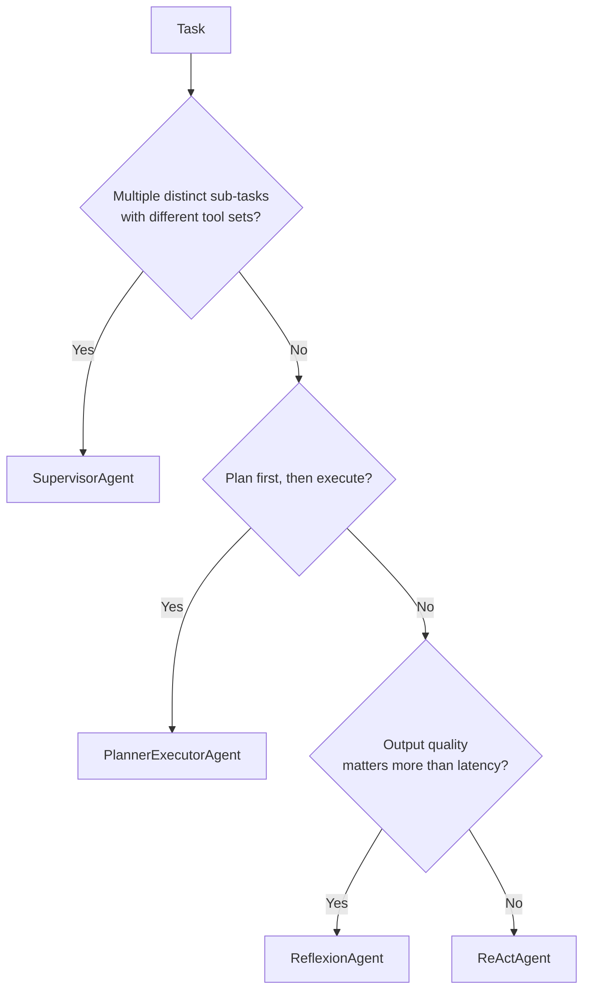
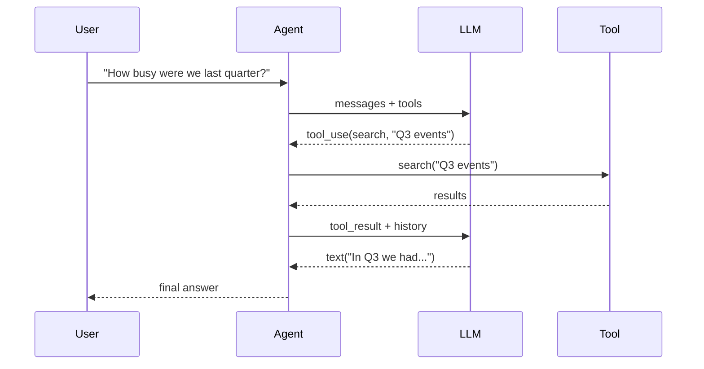
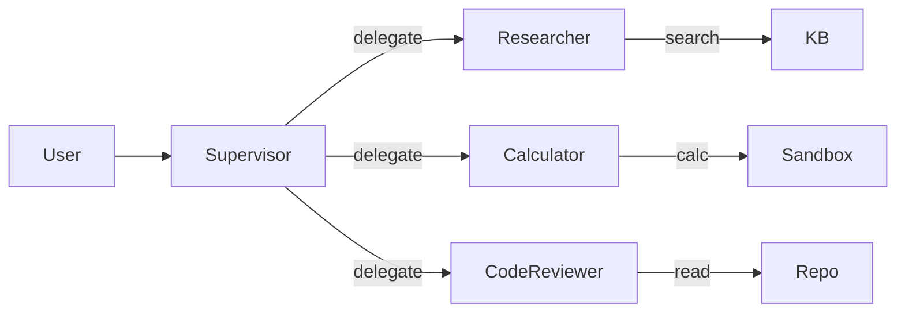
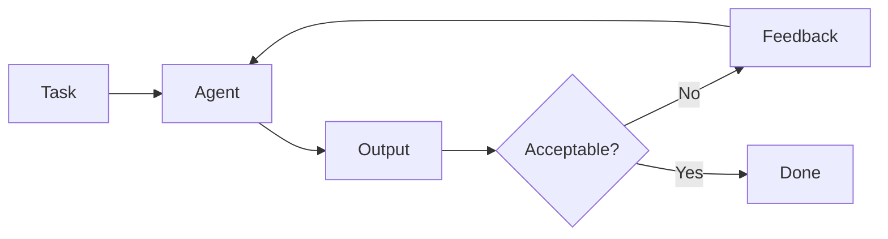

`RO-Claude-kit` ships four agent patterns. Picking the wrong one is the single biggest cause of brittle, expensive agents.

## Decision tree



## ReAct — the default

The classic Reason-Act-Observe loop. The model alternates between reasoning text and tool calls until it decides it's done.



Pick this when:
- Single execution thread, no need for parallel sub-agents.
- Tools are reliable enough that one retry on failure is sufficient.
- You want the simplest pattern that still survives prod.

## Planner-Executor — for multi-step work

A planner LLM produces a structured plan; an executor runs it step-by-step. If a step fails, the planner can revise (replan).

Pick this when:
- The task has multiple distinct sub-tasks that benefit from upfront planning.
- You want checkpoint/resume — completed steps survive a replan.
- Replanning on failure beats retry-in-place.

The Pydantic-typed `Plan` is your contract:

```python
class Plan(BaseModel):
    goal: str
    steps: list[str]
```

The planner emits `<plan>{...}</plan>` — explicit tags make parsing reliable.

## Supervisor — heterogeneous sub-agents

An orchestrator delegates to specialist sub-agents via auto-generated `delegate_to_<name>` tools. Each sub-agent has its own system prompt, tools, and (optionally) model.



Pick this when:
- Sub-tasks have different tool sets or personas.
- You want failure isolation — one sub-agent erroring doesn't kill the run.
- Different sub-tasks benefit from different system prompts or models (Opus orchestrator + Haiku workers, for instance).

## Reflexion — for high-quality output

A ReAct agent runs, then a critic LLM evaluates the output. Unacceptable outputs trigger another attempt with the critique fed back as additional context.



Pick this when:
- Output quality matters more than latency (code generation, drafting, research).
- You can articulate what "good" looks like in a critic prompt.
- First-attempt failures are recoverable with feedback.

Caveat: each attempt is a full agent run, so 3 attempts ≈ 3× the cost. Always cap `max_attempts`.

## Trace contract

Every pattern returns an `AgentResult` with a typed `trace: list[Step]`. Step kinds:

| `kind` | When emitted |
|---|---|
| `thought` | Model reasoning text between tool calls |
| `tool_call` | Each tool invocation, with name + args |
| `tool_result` | Each tool's return (or error) |
| `plan` | The structured plan (Planner-Executor only) |
| `reflection` | Critic verdict (Reflexion only) |
| `final` | The final answer |
| `error` | Recoverable errors (unknown tool, sub-agent crash) |

Pipe the trace into [Langfuse](https://langfuse.com), store it in your DB, or render it in your demo UI.
