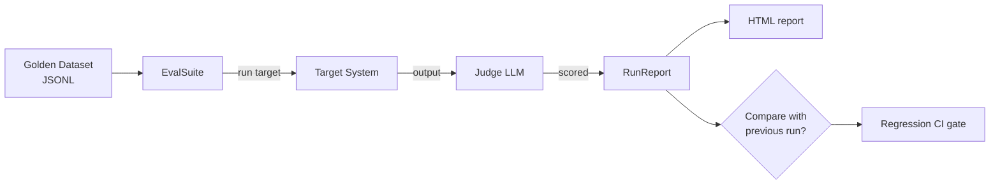

If you can't measure your agent, you can't ship it. The `eval-suite` module gives you the minimum viable eval loop in three pieces.

## The pipeline



## 1. Golden datasets

JSONL, one case per line:

```jsonl
{"id": "case_1", "input": "What is the ReAct pattern?", "expected": "Reasoning + Acting loop with tool use."}
{"id": "case_2", "input": "Summarize this contract...", "metadata": {"category": "summarization"}}
```

`expected` is optional. The judge will use it for grounding when present.

## 2. Rubrics

Pick the dimensions the judge scores on. Default scale is 1–5, integer. Common starting set:

```python
Rubric(criteria=["task_success", "faithfulness", "helpfulness", "safety"])
```

For agentic tasks, add `tool_use_correctness`. For RAG, add `citation_accuracy`.

## 3. Run + report

```python
from ro_claude_kit_eval_suite import EvalSuite, Rubric, GoldenDataset, render_html_report

dataset = GoldenDataset.from_jsonl("./golden.jsonl")
suite = EvalSuite(
    rubric=Rubric(criteria=["task_success", "faithfulness", "safety"]),
    target_model="claude-sonnet-4-6",
    judge_model="claude-opus-4-7",
    target_runner=lambda case: my_agent.run(case.input).output,
    label="v0.4.0",
)
report = suite.run(dataset)
render_html_report(report, "./eval-report.html")
print(report.summary)  # {"task_success": 4.2, "faithfulness": 4.6, "safety": 5.0}
```

The HTML report shows summary bars, per-criterion histograms, and one collapsible card per case with the model's output and the judge's reasoning.

## 4. Drift detection

```python
from ro_claude_kit_eval_suite import detect_drift

baseline = RunReport.model_validate_json(Path("baseline.json").read_text())
candidate = RunReport.model_validate_json(Path("v0.4.0.json").read_text())
drift = detect_drift(baseline, candidate, threshold=0.5)

if drift.has_regression:
    raise SystemExit(f"regressions: {drift.regressions}")
```

Wire `csk-eval drift` into CI to catch quality drops before they merge:

```bash
csk-eval drift baseline.json candidate.json --threshold 0.5
```

The CLI exits non-zero on regression — perfect for a CI gate.

## Failure semantics that don't surprise you

- A target crash on one case records an error and continues the run.
- A judge parse failure records an error on that case and continues.
- The summary mean is computed over non-errored cases only — flaky judges don't bias the mean.

## Production sampling

Once you have a stable rubric, run evals on a sample of prod traffic continuously. Even 1% sampling catches regressions you'd miss in staging.

```python
# pseudo
if random() < 0.01:
    case = EvalCase(id=request_id, input=user_message)
    score = judge_one(case, agent_output, rubric, judge_model, client)
    metrics.gauge("eval.task_success", score.scores["task_success"])
```
