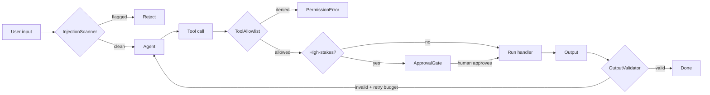

Most demos skip this section. Most agents in prod fail because of what's in this section.

## What attackers and accidents look like



## Prompt-injection scanning

```python
from ro_claude_kit_hardening import InjectionScanner

scanner = InjectionScanner()
result = scanner.scan(user_input)
if result.flagged:
    raise BadInput(f"injection detected: {result.hits}")
```

Default patterns catch instruction-override, persona-hijack, chat-template injection, and prompt-extraction. Add an `llm_classifier` callable for a second layer:

```python
def classify_with_haiku(text: str) -> float:
    # Returns probability the text is adversarial
    ...

scanner = InjectionScanner(llm_classifier=classify_with_haiku, llm_threshold=0.6)
```

For high-risk inputs, also use the **dual-LLM** pattern: keep untrusted text out of the agent's planner LLM. Run it through a sandboxed reader LLM first that summarizes safely.

## Tool allowlist

Block hallucinated or attacker-crafted tool names *before* dispatch:

```python
from ro_claude_kit_hardening import ToolAllowlist

allowlist = ToolAllowlist(allowed={"search", "fetch_doc"})
allowlist.assert_allowed(tool_name)  # raises PermissionError if not allowed
```

The LLM might hallucinate `delete_user`. The allowlist refuses to dispatch it even if the agent code "would have known" the tool exists.

## Approval gates for high-stakes tools

Writes, money movement, deletions — never let those fire without a human looking:

```python
from ro_claude_kit_hardening import ApprovalGate

gate = ApprovalGate()
gate.register("delete_user", delete_user_handler)

pending = gate.request("delete_user", {"user_id": "alice"}, reason="GDPR cleanup")
# Surface pending.id to a human via your review UI...
# When approved:
gate.execute(pending.id)
```

For dev/test, set `auto_approve=True` to bypass.

## Output validation with retry

If you need structured output, never let the agent return free-form text. Validate against a Pydantic schema and retry on failure:

```python
from pydantic import BaseModel
from ro_claude_kit_hardening import OutputValidator

class Verdict(BaseModel):
    classification: Literal["spam", "ham"]
    confidence: float

validator = OutputValidator(output_schema=Verdict, max_attempts=3)
verdict = validator.call(
    system="Classify the message.",
    user_message=incoming_email,
)
```

On failure the validator feeds the Pydantic error back to the model so it can self-correct. Raises `ValidationFailure` if all attempts fail — log it, alert, fall back gracefully.

## Provider-agnostic tracing + PII redaction

```python
from ro_claude_kit_hardening import TraceEmitter

emitter = TraceEmitter(sink=lambda event: langfuse.create_event(event.model_dump()))
trace_id = emitter.start_trace("research-agent", payload={"user": user_email})
emitter.emit(trace_id, "tool_call", "search", {"query": q})
emitter.end_trace(trace_id, "research-agent", {"output": result})
```

Events are PII-redacted by default — emails, SSNs, credit cards, API keys are replaced with placeholders before they hit your sink. Pass `extra_pii_patterns` for org-specific redaction. Set `redact=False` only for trusted dev environments.

The event shape is provider-neutral — write a tiny adapter for Langfuse, Helicone, OpenTelemetry, or your own logging stack.

## A 5-line preflight every request should have

```python
scanner = InjectionScanner()
allowlist = ToolAllowlist(allowed={"search", "fetch", "summarize"})

def preflight(user_input: str, planned_tool: str) -> None:
    scan = scanner.scan(user_input)
    if scan.flagged: raise BadInput(scan.hits)
    allowlist.assert_allowed(planned_tool)
```

This is the difference between an agent that survives the first day in prod and one that doesn't.
