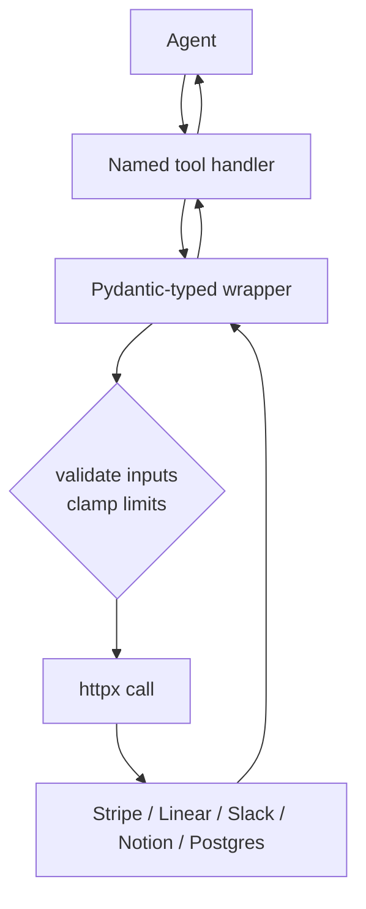

The `mcp-servers` package ships five reference servers. All five are **read-only by design** — there is no path to insert / update / delete from inside any of them. To add write paths, wrap the handler in `ApprovalGate` from the `hardening` package.

## Pattern across servers

Each server follows the same shape:



## Postgres

Two layers of defense:
1. The safety check rejects multi-statement queries, non-SELECT/WITH first keyword, `SELECT ... INTO`, and any destructive keyword.
2. **Use a Postgres role with SELECT-only privileges in production.** The safety check is defense-in-depth, not a substitute for proper DB permissions.

```python
import psycopg2
from ro_claude_kit_mcp_servers import PostgresQueryTool

conn = psycopg2.connect(DATABASE_URL)
tool = PostgresQueryTool(connection=conn, max_rows=500)
rows = tool.query("SELECT id, email FROM users LIMIT 10")
```

## Stripe

Wraps Stripe's REST API. Use a *Restricted Key* scoped to read-only resources — never a live secret key:

```python
from ro_claude_kit_mcp_servers import StripeReadOnlyTools

stripe = StripeReadOnlyTools(api_key="rk_live_...")
customers = stripe.list_customers(email="alice@example.com")
subs = stripe.list_subscriptions(customer_id=customers[0]["id"], status="active")
```

## Linear

GraphQL wrapper. Auth via personal API key from https://linear.app/settings/api:

```python
from ro_claude_kit_mcp_servers import LinearReadOnlyTools

linear = LinearReadOnlyTools(api_key="lin_api_...")
issues = linear.list_issues(team_id="...", state="In Progress")
issue = linear.get_issue("ENG-123")
```

## Slack

Web API wrapper. Bot token (`xoxb-...`) for everything; user token (`xoxp-...`) is required for `search_messages`.

```python
from ro_claude_kit_mcp_servers import SlackReadOnlyTools

slack = SlackReadOnlyTools(bot_token=os.environ["SLACK_BOT_TOKEN"])
channels = slack.list_channels()
history = slack.channel_history(channels[0]["id"])
```

Required scopes: `channels:read`, `channels:history`, `users:read`. For search add `search:read` on a user token.

## Notion

REST wrapper. Auth via internal-integration secret. Make sure the integration is shared only with the pages/databases you want exposed:

```python
from ro_claude_kit_mcp_servers import NotionReadOnlyTools

notion = NotionReadOnlyTools(token="secret_...")
hits = notion.search("agent")
db_rows = notion.query_database(
    "db1",
    filter={"property": "Status", "select": {"equals": "Done"}},
    sorts=[{"property": "Updated", "direction": "descending"}],
)
```

## Plugging into the agent

Each server exports a `*_tools()` factory that returns a name → handler dict:

```python
from ro_claude_kit_mcp_servers import stripe_tools, linear_tools
from ro_claude_kit_agent_patterns import Tool, ReActAgent

handlers = {**stripe_tools(), **linear_tools()}
tools = [
    Tool(
        name=name,
        description=f"{name} (read-only)",
        input_schema={"type": "object"},  # provide proper schema in prod
        handler=handler,
    )
    for name, handler in handlers.items()
]

agent = ReActAgent(system="...", tools=tools)
```

In production, write proper JSON schemas for each tool — the agent's argument quality is bounded by the schema's specificity.

## Adding write paths

Don't add write methods to these classes directly. Instead, build a separate `WriteOps` class and put it behind `ApprovalGate`:

```python
from ro_claude_kit_hardening import ApprovalGate

gate = ApprovalGate()
gate.register("stripe_refund_charge", stripe.refund_charge)
pending = gate.request("stripe_refund_charge", {"charge_id": "ch_..."}, reason="customer asked")
# Human reviews pending.id, then:
gate.execute(pending.id)
```
