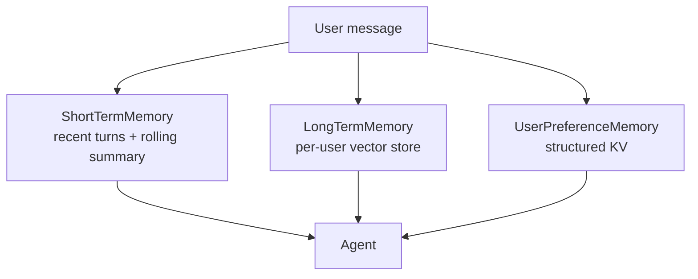

Conversation history that just keeps growing eventually blows your context window. You need a memory strategy. The `memory` module gives you three layers:



## Short-term — rolling summary

Conversation turns with smart compression. When token estimate crosses `compress_threshold_tokens`, older turns are summarized via Claude and dropped; the last `keep_recent` turns stay verbatim.

```python
from ro_claude_kit_memory import ShortTermMemory

mem = ShortTermMemory(keep_recent=6, compress_threshold_tokens=4000)
mem.add_turn("user", "What's your name?")
mem.add_turn("assistant", "Claude.")

client.messages.create(
    model="claude-sonnet-4-6",
    messages=mem.messages(),
    max_tokens=1024,
)

# After enough turns, compress on the fly:
mem.maybe_compress()
```

The summary is injected as a synthetic user/assistant pair on `messages()` so it works with any Anthropic-shaped chat call.

## Long-term — per-user vector store

```python
from ro_claude_kit_memory import LongTermMemory

mem = LongTermMemory()  # in-memory backend by default
mem.remember("user prefers dark mode", namespace="alice", source="onboarding")
hits = mem.recall("UI preferences", namespace="alice", k=3)
```

The default `InMemoryBackend` uses Jaccard scoring — fine for dev/tests but not production. For prod, swap in a vector store backend by writing a class with `upsert` / `query` / `delete`:

```python
class ChromaDBBackend:
    def __init__(self, client, collection: str):
        self.collection = client.get_or_create_collection(collection)

    def upsert(self, record):
        self.collection.upsert(
            ids=[record.id],
            documents=[record.text],
            metadatas=[{"namespace": record.namespace, **record.metadata}],
        )

    def query(self, namespace, text, k=5):
        results = self.collection.query(
            query_texts=[text],
            n_results=k,
            where={"namespace": namespace},
        )
        # ... map to MemoryRecord ...

mem = LongTermMemory(backend=ChromaDBBackend(client, "memories"))
```

The `chromadb` extra is declared optional: `uv pip install ro-claude-kit-memory[chromadb]`.

## Preferences — structured key-value with extraction

Sometimes you want durable user facts in a queryable shape, not embedded in fuzzy vector search.

```python
from ro_claude_kit_memory import UserPreferenceMemory

prefs = UserPreferenceMemory()
prefs.set("alice", "tone", "concise")
prefs.set("alice", "timezone", "America/Los_Angeles")
```

The interesting part: `extract_from_message` uses Claude to pull durable preferences out of free-form messages and store them automatically.

```python
stored = prefs.extract_from_message(
    "alice",
    "I'm in LA and I prefer short answers."
)
# -> [("timezone", "America/Los_Angeles"), ("tone", "concise")]
```

The store is a plain dict — persist it however you like (Postgres JSONB, Redis, file).

## When to use which

| Layer | Best for |
|---|---|
| Short-term | Multi-turn chats; preventing context window blowup |
| Long-term | "Remember when we discussed X last week?" — fuzzy recall across sessions |
| Preferences | Structured facts: timezone, tone, language, role — used to template prompts |

You can stack all three. The customer-support example does exactly that.
