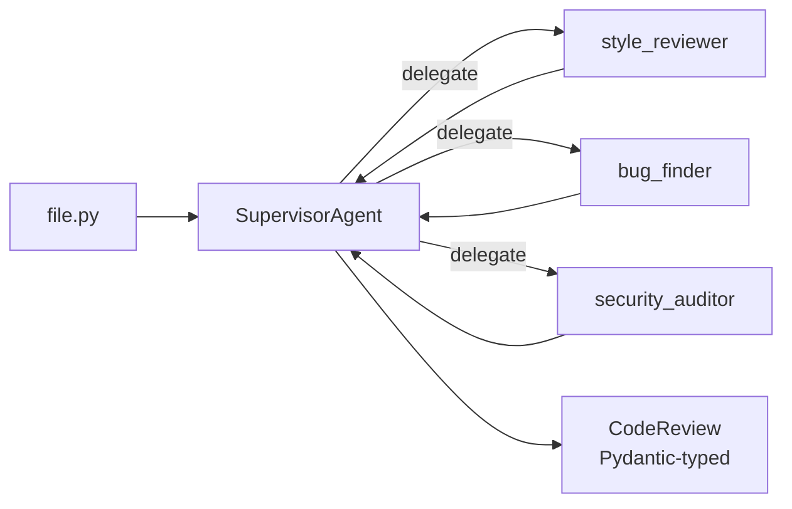

The [`examples/code-reviewer`](https://github.com/rohithkandula19/RO-Claude-kit/tree/main/examples/code-reviewer) example uses the Supervisor pattern to run three independent specialists over a file and aggregate their findings into one structured `CodeReview`.

## Why one orchestrator, three specialists?

A single prompt that tries to be a style critic AND a bug hunter AND a security auditor produces middling results across the board. Splitting concerns means each specialist can:

- Use a focused system prompt
- Stay in scope (the security auditor doesn't comment on naming)
- Run with a different model if you want (cheap model for style, strong model for security)

The orchestrator only does aggregation + dedup + severity rollup.



## The schema

```python
class Finding(BaseModel):
    severity: Literal["info", "low", "medium", "high", "critical"]
    line: int | None = None
    title: str
    explanation: str
    suggestion: str | None = None
    category: Literal["style", "bug", "security"]


class CodeReview(BaseModel):
    summary: str
    findings: list[Finding]
    overall_severity: Literal["clean", "minor", "needs_work", "block"]
```

`overall_severity` is the CI gate. Wire `block` to fail the build:

```yaml
# .github/workflows/code-review.yml (sketch)
- run: |
    uv run python examples/code-reviewer/main.py "$CHANGED_FILE" > review.json
    severity=$(jq -r .overall_severity review.json)
    if [ "$severity" = "block" ]; then exit 1; fi
```

## Run it on the included buggy sample

```bash
export ANTHROPIC_API_KEY=sk-ant-...
uv run python examples/code-reviewer/main.py examples/code-reviewer/sample_buggy_code.py
```

The sample has five planted issues — SQL injection, command injection, path traversal, a hardcoded secret, and a missing zero check. A good run finds at least the security ones at high/critical severity.

## Adapt it

- **Add a fourth specialist** — performance reviewer, accessibility auditor, license-compliance checker. Same pattern.
- **Wrap with `Reflexion`** — the orchestrator's aggregate review goes through a critic LLM that can reject vague findings and trigger a retry.
- **Use Ollama for the cheap reviewers, Claude for security** — pass different `provider` instances to each `SubAgent`.
