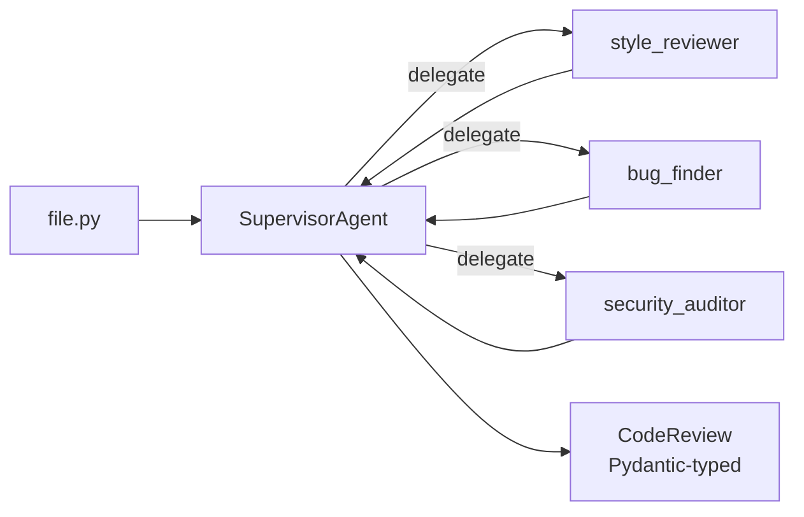

# examples/code-reviewer

Multi-agent code review built on RO-Claude-kit. Three specialists review a file independently — a style reviewer, a bug finder, a security auditor — and the orchestrator aggregates their findings into a single Pydantic-typed `CodeReview`.

## Run

```bash
export ANTHROPIC_API_KEY=sk-ant-...
uv run python examples/code-reviewer/main.py examples/code-reviewer/sample_buggy_code.py
```

The included `sample_buggy_code.py` has five planted issues — SQL injection, command injection, path traversal, a hardcoded secret, and a missing zero check. The reviewers should find most of them.

## What it shows



The `CodeReview` schema constrains the output:
- `summary` — one paragraph
- `findings: list[Finding]` — each with severity, line, category, suggestion
- `overall_severity` — clean / minor / needs_work / block

So you can pipe this directly into a CI check that fails the build on `block`, or render it as a PR comment.

## Adapt it

- Swap `provider=AnthropicProvider()` for `OllamaProvider(model="...")` to run locally.
- Add a fourth specialist for performance / accessibility / spec-compliance.
- Wrap with `Reflexion` for a self-critique loop on the aggregate review.
