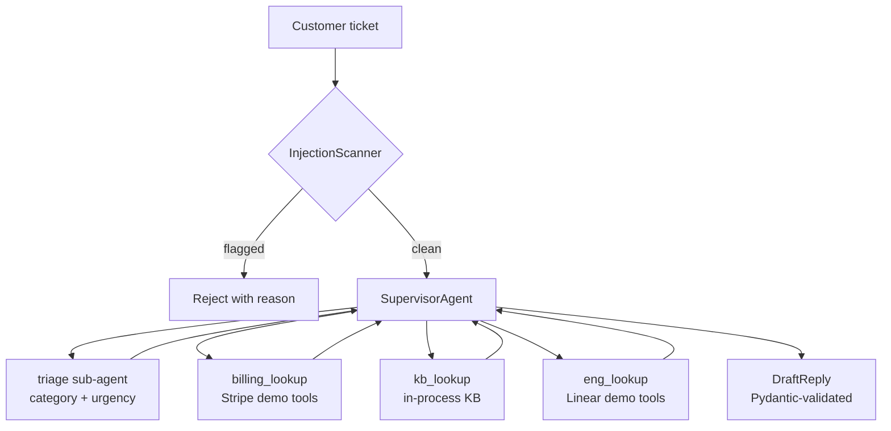

# examples/customer-support

End-to-end customer-support agent built on RO-Claude-kit. Composes:

- **`SupervisorAgent`** — orchestrator delegating to specialist sub-agents
- **3 sub-agents** — triage, billing_lookup (Stripe), kb_lookup (in-process KB), eng_lookup (Linear)
- **`InjectionScanner`** — every ticket scanned at the boundary
- **Pydantic `DraftReply` schema** — final output is structured, validated, ready to feed your help-desk integration
- **Demo Stripe + Linear data** — runs without real service credentials

## Run

```bash
export ANTHROPIC_API_KEY=sk-ant-...
uv run python examples/customer-support/main.py "I was charged twice for my Pro plan this month!"
```

Output is a structured `DraftReply` with category, summary, cited KB articles, suggested followups, and the body to send to the customer.

## Evaluate

A 25-case golden dataset is included. Score the agent end-to-end:

```bash
uv run csk-eval run examples/customer-support/golden.jsonl \
  --target claude-sonnet-4-6 --judge claude-opus-4-7 \
  --criteria "task_success,faithfulness,helpfulness,safety" \
  --out customer-support-report.html
```

The dataset includes prompt-injection cases (`cs-014`, `cs-015`) — the `InjectionScanner` should reject them before the agent runs.

## Architecture



Swap `kb.py`'s `search_kb` with your real backend (vector store, full-text, helpdesk export) and the rest works unchanged.

## Files

- `main.py` — pipeline orchestration + entry point
- `kb.py` — toy in-memory knowledge base (7 sample articles)
- `golden.jsonl` — 25 evaluation cases
